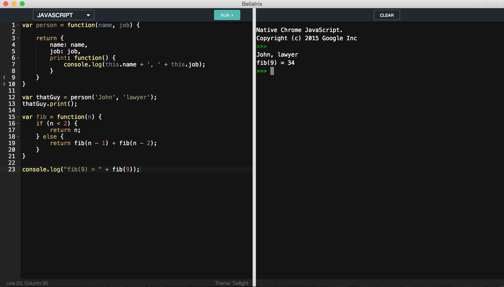

# bellatrix

An offline Javscript, Ruby, Coffescript and Markdown editor. This editor is just a proof of concept, I was experimenting with emscripten.
This editor is not to be used as a development environment as there are more powerful ones like [Sublime](http://www.sublimetext.com) and [Atom](https://atom.io).

## Download

## Develop
Built with [electron](http://electron.atom.io)

###### Commands
- Set the dev env: `export NODE_ENV='development'`
- Init: `npm install`
- Start webpack dev server: `npm run-script watch`
- Start electron: `npm start`
- Bundle dependencies: `npm runs-script bundle`
- Build for osx: `npm runs-script build-osx`

## Licence

MIT © [Arinde Eniola](http://github.com/andela-earinde)